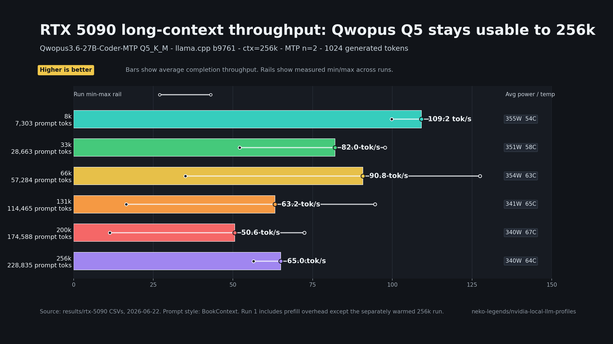
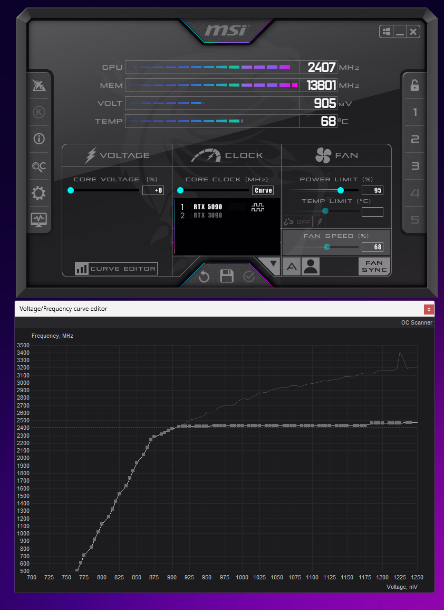

# nvidia-local-llm-profiles

RTX 5090 local LLM optimization profiles — benchmarks, launchers, and Hermes
integration for running high-performance local inference on NVIDIA Blackwell.

Hand this repo to a coding agent and it can download the model, start a local
OpenAI-compatible endpoint, wire Hermes, run benchmarks, and collect the proof.



**Current focus:** Qwopus3.6-27B-Coder-MTP Q5_K_M via llama.cpp, plus AEON
Qwen3.6 27B Multimodal NVFP4 MTP-XS via vLLM.

---

## Model

**Qwopus3.6-27B-Coder-MTP-Q5_K_M** — a merged/tuned Qwen3.6 27B coder model with
embedded MTP draft head, quantized to Q5_K_M GGUF. Runs via llama.cpp with
`--spec-type draft-mtp` for speculative decoding.

Hugging Face model: [Jackrong/Qwopus3.6-27B-Coder-MTP-GGUF](https://huggingface.co/Jackrong/Qwopus3.6-27B-Coder-MTP-GGUF)

Credit and lineage:

- Primary GGUF release: [Jackrong/Qwopus3.6-27B-Coder-MTP-GGUF](https://huggingface.co/Jackrong/Qwopus3.6-27B-Coder-MTP-GGUF)
- Base model card: [Jackrong/Qwopus3.6-27B-v2](https://huggingface.co/Jackrong/Qwopus3.6-27B-v2)
- The model card credits the Qwen team for the Qwen3.6-27B base, Jackrong for
  the Qwopus training work, and the MTP/GGUF release for local speculative
  decoding.

Why this profile uses it:

- It is a current best-fit coding model for RTX 5090-class local inference:
  large enough for strong repository-level coding and tool-use behavior, while
  still fitting on a 32GB Blackwell card as a Q5_K_M GGUF.
- The MTP draft head lets llama.cpp use speculative decoding for much higher
  interactive throughput.
- With the 256k llama.cpp profile here, it keeps full long-context operation on
  the 5090 without dropping to a smaller coding model.

> Note: A Hugging Face account may be required to download. Run
> `huggingface-cli login` and set up a token at huggingface.co/settings/tokens
> if you get a 401 error.

---

## Additional Model Support

### AEON Qwen3.6 27B Multimodal NVFP4 MTP-XS

This repo also includes a vLLM/Docker support folder for
[AEON-7/Qwen3.6-27B-AEON-Ultimate-Uncensored-Multimodal-NVFP4-MTP-XS](https://huggingface.co/AEON-7/Qwen3.6-27B-AEON-Ultimate-Uncensored-Multimodal-NVFP4-MTP-XS).

Use this when you want to test the AEON XS safetensors/modelopt NVFP4 path on
RTX 5090-class hardware. It is not a GGUF/llama.cpp profile; the tested Windows
launcher serves it with `vllm/vllm-openai:latest`, fp8 KV cache, and a 200k
context cap.

Observed Windows note: AEON NVFP4 loaded and completed the benchmark ladder, but
throughput was lower than hoped on this setup. Treat these numbers as a Windows
driver/container/NVFP4 compatibility baseline, not as the model's likely ceiling.

Launcher folder:

```text
scripts\vllm\aeon-qwen36-27b-multimodal-nvfp4-mtp-xs\
```

Quick path:

```bat
download-aeon-qwen36-27b-multimodal-nvfp4-mtp-xs.bat
start-aeon-qwen36-27b-multimodal-nvfp4-mtp-xs-vllm-docker.bat
bench-aeon-qwen36-27b-multimodal-nvfp4-mtp-xs-context-ladder.bat
```

Endpoint defaults:

- Base URL: `http://127.0.0.1:39183/v1`
- Model: `aeon-qwen36-27b-multimodal-nvfp4-mtp-xs`
- Benchmark case prefix: `aeon-qwen36-27b-multimodal-nvfp4-mtp-xs-vllm-fp8kv-ctx200k`

See `docs/models/aeon-qwen36-27b-multimodal-nvfp4-mtp-xs.md` for the model
notes and serving assumptions.

### NVIDIA Qwen3.6 35B A3B NVFP4 MoE

Minimal vLLM/Docker support for
[nvidia/Qwen3.6-35B-A3B-NVFP4](https://huggingface.co/nvidia/Qwen3.6-35B-A3B-NVFP4).
This profile only runs the quick two-point check requested here: about 10k and
200k prompt tokens, one measured run each.

Launcher folder:

```text
scripts\vllm\qwen36-35b-a3b-nvfp4\
```

### Unsloth Qwen3.6 35B A3B MTP GGUF

Minimal llama.cpp support for
[unsloth/Qwen3.6-35B-A3B-MTP-GGUF](https://huggingface.co/unsloth/Qwen3.6-35B-A3B-MTP-GGUF),
using `Qwen3.6-35B-A3B-UD-Q4_K_XL.gguf`.

Launcher folder:

```text
scripts\localai\qwen36-35b-a3b-mtp-gguf\
```

---

## RTX 5090 Benchmark Results

**GPU:** RTX 5090 32GB — **Driver:** 610.62 — **Dates:** 2026-06-22 to
2026-06-23

BookContext prompt ladder — gen=1024 tok — temperature=0 — 3 measured runs


### Qwopus3.6-27B-Coder-MTP-Q5_K_M

llama.cpp b9761 — ctx=256k — MTP n=2

| Context | avg tok/s | Power | Temp |
| ---: | ---: | ---: | ---: |
| 8k | **109 tok/s** | 355W | 54C |
| 33k | 82 tok/s | 351W | 58C |
| 66k | 91 tok/s | 354W | 63C |
| 131k | 63 tok/s | 341W | 65C |
| 200k | 51 tok/s | 340W | 67C |
| 256k | 65 tok/s | 340W | 64C |

### AEON Qwen3.6 27B Multimodal NVFP4 MTP-XS

vLLM OpenAI — modelopt NVFP4 — fp8 KV — ctx=200k — qwen3_5_mtp

| Context | avg tok/s | Power | Temp |
| ---: | ---: | ---: | ---: |
| 8k | 48 tok/s | 162W | 47C |
| 33k | 45 tok/s | 170W | 50C |
| 66k | 41 tok/s | 176W | 53C |
| 131k | 39 tok/s | 187W | 57C |
| 200k | 36 tok/s | 216W | 59C |

AEON completed the 8k-200k ladder, but this Windows setup did not produce high
NVFP4 throughput. A possible culprit is the modelopt NVFP4 path on this specific
Windows/container/driver stack rather than a simple VRAM limit.

Full per-run CSVs: `results/rtx-5090/`

### Qwen3.6 35B Local Variants

Two-point smoke benchmarks only, one measured run per context.


| Model | Context | Actual prompt tokens | avg tok/s | Power | Temp |
| --- | ---: | ---: | ---: | ---: | ---: |
| nvidia/Qwen3.6-35B-A3B-NVFP4 | 10k target | 8,905 | 76.6 tok/s | 172W | 47C |
| nvidia/Qwen3.6-35B-A3B-NVFP4 | 200k target | 174,588 | 33.7 tok/s | 228W | 55C |
| unsloth/Qwen3.6-35B-A3B-MTP-GGUF UD-Q4_K_XL | 10k target | 8,907 | 96.3 tok/s | 174W | 46C |
| unsloth/Qwen3.6-35B-A3B-MTP-GGUF UD-Q4_K_XL | 200k target | 174,590 | 14.2 tok/s | 222W | 57C |

The GGUF profile was fast at short context, but this 200k-profile run was slow
at long context. The NVIDIA NVFP4 vLLM profile loaded with a 200k max context and
used roughly 30GB VRAM while idle.

---

## Windows Stability Note

Apply a conservative MSI Afterburner voltage/frequency curve before long
Windows inference runs on the RTX 5090. On this Windows test box, leaving stock
boost behavior in place can crash during sustained high-VRAM LLM runs.



Why this matters:

- Sustained local LLM inference is a VRAM-heavy load, not a short gaming burst.
- Some cards cannot hold aggressive core clocks while VRAM stays heavily
  occupied for long-context runs.
- The goal is stable model and KV-cache residency in 32GB VRAM; max core clock is
  less important than avoiding crashes and throttling.
- A lower, flatter curve also saves electricity because it avoids spending power
  on core boost that does not materially improve this profile.

See `docs/hardware/rtx-5090-power-and-thermal.md` for the full checklist.

---

## Quick Start

**1. Download the model**

```bat
scripts\localai\qwopus3.6-27b-coder-mtp-gguf\download-qwopus3.6-27B-Coder-MTP-Q5.bat
```

**2. Install the launcher**

```powershell
powershell -ExecutionPolicy Bypass -File scripts\localai\qwopus3.6-27b-coder-mtp-gguf\install-to-LocalAI.ps1
```

**3. Start the server**

```bat
start-qwopus3.6-27b-coder-mtp-q5-server.bat
```

Serves OpenAI-compatible endpoint at `http://127.0.0.1:39182/v1`

**4. Add to Hermes Desktop**

Run the Local 5090 installer:

```bat
scripts\hermes\install-local-5090-provider.bat
```

This updates Hermes Desktop with a single `Local 5090` provider:

- `qwopus3.6-27b-coder-mtp-q5-k-m` routes to `http://127.0.0.1:39182/v1`
- `diffusiongemma` routes to `http://127.0.0.1:8890/v1`
- Hermes talks to the local router at `http://127.0.0.1:39190/v1`
- The script backs up `%LOCALAPPDATA%\hermes\config.yaml` before editing it.

Hermes uses one base URL per provider, so the tiny router lets both local model
servers appear together under `Local 5090`.

Restart Hermes Desktop after running the script, then pick the model from the
menu:


See `docs/integrations/hermes-desktop.md` for the exact config shape and router
details.

---

## Benchmarking

Run a context ladder:

```powershell
powershell -ExecutionPolicy Bypass -File scripts\benchmarks\bench-context-ladder.ps1
```

Render the benchmark chart:

```powershell
python scripts\benchmarks\render-rtx5090-context-chart.py
```

Requires Matplotlib (`pip install matplotlib`) if your Python environment does
not already include it.

Run a single endpoint bench:

```powershell
powershell -ExecutionPolicy Bypass -File scripts\benchmarks\bench-openai-chat-endpoint.ps1 `
  -BaseUrl http://127.0.0.1:39182/v1 `
  -Model qwopus3.6-27b-coder-mtp-q5-k-m `
  -TargetPromptTokens 8192 `
  -MaxTokens 1024
```

---

## Repo Structure

```
scripts/
  hermes/
    install-local-5090-provider.bat    add the Local 5090 Hermes provider
    local-5090-router.py               local model router used by Hermes
  localai/
    qwopus3.6-27b-coder-mtp-gguf/   launchers, download, install
    qwen36-35b-a3b-mtp-gguf/        Unsloth Qwen 35B GGUF launcher
  vllm/
    aeon-qwen36-27b-multimodal-nvfp4-mtp-xs/  Docker vLLM launcher
    qwen36-35b-a3b-nvfp4/            NVIDIA MoE NVFP4 two-point bench
  benchmarks/
    bench-context-ladder.ps1         full context ladder sweep
    bench-openai-chat-endpoint.ps1   single endpoint benchmark
    download-hf-artifact.py          HF download helper
    render-qwen35-moe-comparison-chart.py     MoE vs Qwopus chart
docs/
  models/qwopus3.6-27b-coder-mtp-gguf.md   model notes
  models/aeon-qwen36-27b-multimodal-nvfp4-mtp-xs.md   AEON vLLM notes
  hardware/rtx-5090-power-and-thermal.md    GPU tuning notes
  integrations/hermes-desktop.md            Hermes wiring guide
results/
  rtx-5090/                                 benchmark CSVs + README
```
