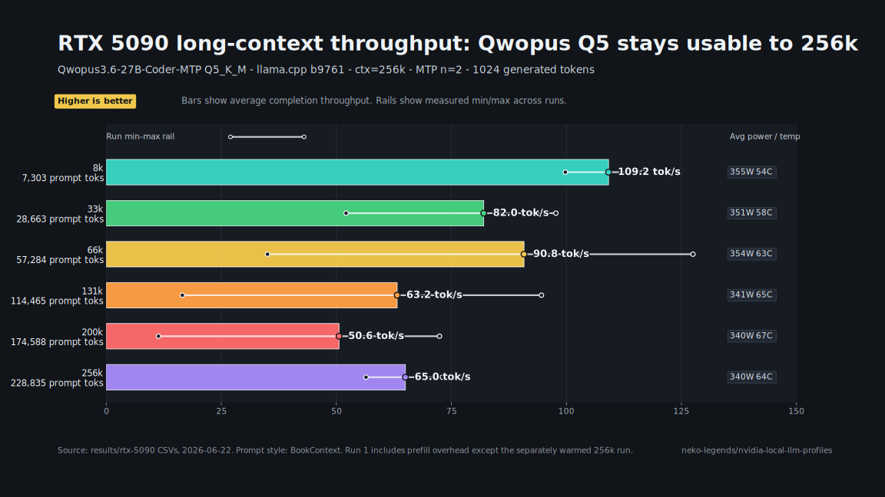

# nvidia-local-llm-profiles

RTX 5090 local LLM optimization profiles — benchmarks, launchers, and Hermes
integration for running high-performance local inference on NVIDIA Blackwell.

**Current focus: Qwopus3.6-27B-Coder-MTP Q5_K_M via llama.cpp**

---

## Model

**Qwopus3.6-27B-Coder-MTP-Q5_K_M** — a merged/tuned Qwen3.6 27B coder model with
embedded MTP draft head, quantized to Q5_K_M GGUF. Runs via llama.cpp with
`--spec-type draft-mtp` for speculative decoding.

Hugging Face model: [Jackrong/Qwopus3.6-27B-Coder-MTP-GGUF](https://huggingface.co/Jackrong/Qwopus3.6-27B-Coder-MTP-GGUF)

Credit and lineage:

- Primary GGUF release: [Jackrong/Qwopus3.6-27B-Coder-MTP-GGUF](https://huggingface.co/Jackrong/Qwopus3.6-27B-Coder-MTP-GGUF)
- Base model card: [Jackrong/Qwopus3.6-27B-v2](https://huggingface.co/Jackrong/Qwopus3.6-27B-v2)
- The model card credits the Qwen team for the Qwen3.6-27B base, Jackrong for
  the Qwopus training work, and the MTP/GGUF release for local speculative
  decoding.

Why this profile uses it:

- It is a current best-fit coding model for RTX 5090-class local inference:
  large enough for strong repository-level coding and tool-use behavior, while
  still fitting on a 32GB Blackwell card as a Q5_K_M GGUF.
- The MTP draft head lets llama.cpp use speculative decoding for much higher
  interactive throughput.
- With the 256k llama.cpp profile here, it keeps full long-context operation on
  the 5090 without dropping to a smaller coding model.

> Note: A Hugging Face account may be required to download. Run
> `huggingface-cli login` and set up a token at huggingface.co/settings/tokens
> if you get a 401 error.

---

## RTX 5090 Benchmark Results

**GPU:** RTX 5090 32GB — **Driver:** 610.62 — **Date:** 2026-06-22

llama.cpp b9761 — ctx=256k — MTP n=2 — gen=1024 tok — 3 measured runs



| Context | avg tok/s | Power | Temp |
| ---: | ---: | ---: | ---: |
| 8k | **109 tok/s** | 355W | 54C |
| 33k | 82 tok/s | 351W | 58C |
| 66k | 91 tok/s | 354W | 63C |
| 131k | 63 tok/s | 341W | 65C |
| 200k | 51 tok/s | 340W | 67C |
| 256k | 65 tok/s | 340W | 64C |

Full per-run CSVs: `results/rtx-5090/`

---

## Windows Stability Note

Apply a conservative MSI Afterburner voltage/frequency curve before long
Windows inference runs on the RTX 5090.


Why this matters:

- Sustained local LLM inference is a VRAM-heavy load, not a short gaming burst.
- On this Windows test box, stock boost behavior could crash during sustained
  high-VRAM usage.
- Some cards cannot hold aggressive core clocks while the VRAM stays heavily
  occupied for long-context runs.
- The goal is stable model and KV-cache residency in 32GB VRAM; max core clock is
  less important than avoiding crashes and throttling.
- A lower, flatter curve also saves electricity because it avoids spending power
  on core boost that does not materially improve this profile.

See `docs/hardware/rtx-5090-power-and-thermal.md` for the full checklist.

---

## Quick Start

**1. Download the model**

```bat
scripts\localai\qwopus3.6-27b-coder-mtp-gguf\download-qwopus3.6-27B-Coder-MTP-Q5.bat
```

**2. Install the launcher**

```powershell
powershell -ExecutionPolicy Bypass -File scripts\localai\qwopus3.6-27b-coder-mtp-gguf\install-to-LocalAI.ps1
```

**3. Start the server**

```bat
start-qwopus3.6-27b-coder-mtp-q5-server.bat
```

Serves OpenAI-compatible endpoint at `http://127.0.0.1:39182/v1`

**4. Wire into Hermes**

```
/provider add custom:qwopus-local http://127.0.0.1:39182/v1 <any-key>
/model custom:qwopus-local:qwopus3.6-27b-coder-mtp-q5-k-m
```

---

## Benchmarking

Run a context ladder:

```powershell
powershell -ExecutionPolicy Bypass -File scripts\benchmarks\bench-context-ladder.ps1
```

Render the benchmark chart:

```powershell
python scripts\benchmarks\render-rtx5090-context-chart.py
```

Run a single endpoint bench:

```powershell
powershell -ExecutionPolicy Bypass -File scripts\benchmarks\bench-openai-chat-endpoint.ps1 `
  -BaseUrl http://127.0.0.1:39182/v1 `
  -Model qwopus3.6-27b-coder-mtp-q5-k-m `
  -TargetPromptTokens 8192 `
  -MaxTokens 1024
```

---

## Repo Structure

```
scripts/
  localai/
    qwopus3.6-27b-coder-mtp-gguf/   launchers, download, install
  benchmarks/
    bench-context-ladder.ps1         full context ladder sweep
    bench-openai-chat-endpoint.ps1   single endpoint benchmark
    download-hf-artifact.py          HF download helper
docs/
  models/qwopus3.6-27b-coder-mtp-gguf.md   model notes
  hardware/rtx-5090-power-and-thermal.md    GPU tuning notes
  integrations/hermes-desktop.md            Hermes wiring guide
results/
  rtx-5090/                                 benchmark CSVs + README
```
