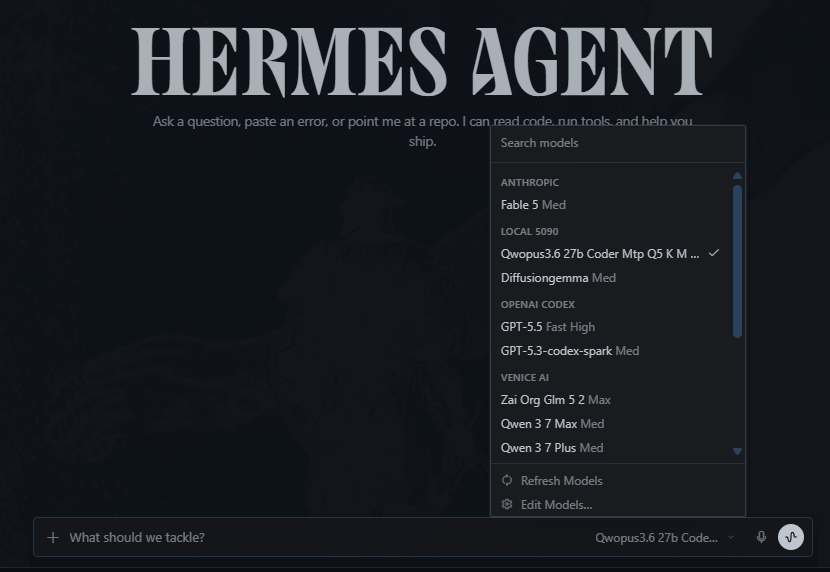

# Hermes Desktop Integration

Hermes can use these local model servers through their OpenAI-compatible `/v1`
endpoints.

## Local 5090 Provider

The recommended desktop setup is one Hermes provider named `Local 5090` that
lists the local model servers:

- `qwopus3.6-27b-coder-mtp-q5-k-m`
- `qwopus3.6-35b-a3b-coder-mtp-q5-k-m`
- `diffusiongemma`
- `aeon-ornith-1.0-35b-nvfp4`
- `ornith-1.0-35b-q4-k-m`
- `ornith-1.0-35b-q5-k-m`



Hermes custom providers are anchored to one base URL. Since Qwopus,
DiffusionGemma, AEON Ornith, and GGUF Ornith are served by different local
endpoints, this repo includes a small local router that exposes one `/v1`
endpoint for Hermes and routes each request by the `model` field.

Run:

```bat
scripts\hermes\install-local-5090-provider.bat
```

What it does:

- Backs up `%LOCALAPPDATA%\hermes\config.yaml`.
- Copies `scripts\hermes\local-5090-router.py` into
  `%LOCALAPPDATA%\hermes\local-5090-router\`.
- Starts the router at `http://127.0.0.1:39190/v1`.
- Replaces old `diffusiongemma-local`, `qwopus-local`, `ornith-local`,
  `ornith-q5-local`, `aeon-ornith-local`, or `aeon-ornith-nvfp4-local`
  custom providers with one `Local 5090` provider.

Installed Hermes config shape:

```yaml
custom_providers:
- api_mode: chat_completions
  base_url: http://127.0.0.1:39190/v1
  discover_models: true
  model: qwopus3.6-27b-coder-mtp-q5-k-m
  models:
    diffusiongemma:
      context_length: 64000
      supports_vision: false
    qwopus3.6-27b-coder-mtp-q5-k-m:
      context_length: 262144
      supports_vision: false
    qwopus3.6-35b-a3b-coder-mtp-q5-k-m:
      context_length: 200000
      supports_vision: false
    aeon-ornith-1.0-35b-nvfp4:
      context_length: 262144
      supports_vision: true
    ornith-1.0-35b-q4-k-m:
      context_length: 262144
      supports_vision: false
    ornith-1.0-35b-q5-k-m:
      context_length: 262144
      supports_vision: false
  name: Local 5090
```

Default local routes:

```text
Hermes -> http://127.0.0.1:39190/v1
  diffusiongemma                     -> http://127.0.0.1:8890/v1
  qwopus3.6-27b-coder-mtp-q5-k-m     -> http://127.0.0.1:39182/v1
  qwopus3.6-35b-a3b-coder-mtp-q5-k-m -> http://127.0.0.1:39191/v1
  aeon-ornith-1.0-35b-nvfp4          -> http://127.0.0.1:39187/v1
  ornith-1.0-35b-q4-k-m              -> http://127.0.0.1:39188/v1
  ornith-1.0-35b-q5-k-m              -> http://127.0.0.1:39189/v1
```

Restart Hermes Desktop after running the installer so the model menu refreshes.
Start the actual model server before selecting that model.

## Qwopus3.6-27B-Coder-MTP Q5_K_M

Start the server (from the installed folder):

```bat
start-qwopus3.6-27b-coder-mtp-q5-server.bat
```

Wire into Hermes (same machine):

```text
Provider/API: OpenAI-compatible chat completions
Base URL:     http://127.0.0.1:39182/v1
API key:      none (or any placeholder)
Model:        qwopus3.6-27b-coder-mtp-q5-k-m
```

Hermes CLI shortcut:

```
/provider add custom:qwopus-local http://127.0.0.1:39182/v1 local
/model custom:qwopus-local:qwopus3.6-27b-coder-mtp-q5-k-m
```

Remote access from another machine on the LAN:

```text
Base URL:  http://<your-server-lan-ip>:39182/v1
Model:     qwopus3.6-27b-coder-mtp-q5-k-m
```

If the client cannot connect, run once as admin on the server:

```bat
allow-qwopus3.6-coder-mtp-server-firewall-admin.bat
```

## Qwopus3.6-35B-A3B-Coder-MTP Q5_K_M

Start the server from the repo checkout:

```bat
scripts\localai\qwopus3.6-35b-a3b-coder-mtp-gguf\start-qwopus3.6-35b-a3b-coder-mtp-q5-k-m-server.bat
```

Wire into Hermes through the consolidated provider:

```text
Provider/API: Local 5090
Base URL:     http://127.0.0.1:39190/v1
Model:        qwopus3.6-35b-a3b-coder-mtp-q5-k-m
```

Direct endpoint:

```text
Base URL:  http://127.0.0.1:39191/v1
Model:     qwopus3.6-35b-a3b-coder-mtp-q5-k-m
```

## AEON Qwen3.6 27B Multimodal NVFP4 MTP-XS

Start the vLLM Docker server:

```bat
start-aeon-qwen36-27b-multimodal-nvfp4-mtp-xs-vllm-docker.bat
```

Wire into Hermes (same machine):

```text
Provider/API: OpenAI-compatible chat completions
Base URL:     http://127.0.0.1:39183/v1
API key:      none (or any placeholder)
Model:        aeon-qwen36-27b-multimodal-nvfp4-mtp-xs
```

Hermes CLI shortcut:

```text
/provider add custom:aeon-local http://127.0.0.1:39183/v1 local
/model custom:aeon-local:aeon-qwen36-27b-multimodal-nvfp4-mtp-xs
```

Remote access from another machine on the LAN:

```text
Base URL:  http://<your-server-lan-ip>:39183/v1
Model:     aeon-qwen36-27b-multimodal-nvfp4-mtp-xs
```

If the client cannot connect, run once as admin on the server:

```bat
allow-aeon-qwen36-vllm-firewall-admin.bat
```

## Verify the Endpoint

Local 5090 router:

```powershell
Invoke-RestMethod http://127.0.0.1:39190/v1/models
```

Direct Qwopus endpoint:

```powershell
Invoke-RestMethod http://127.0.0.1:39182/v1/models

$body = @{
  model = "qwopus3.6-27b-coder-mtp-q5-k-m"
  messages = @(@{ role = "user"; content = "Reply with only: OK" })
  max_tokens = 8
} | ConvertTo-Json -Depth 8

Invoke-RestMethod -Uri http://127.0.0.1:39182/v1/chat/completions `
  -Method Post -ContentType "application/json" -Body $body
```

For AEON, use port `39183` and model
`aeon-qwen36-27b-multimodal-nvfp4-mtp-xs` in the same request shape.

For AEON Ornith NVFP4, use port `39187` and model
`aeon-ornith-1.0-35b-nvfp4`.

For Ornith Q5_K_M, use port `39189` and model `ornith-1.0-35b-q5-k-m`.

For Qwopus3.6 35B Q5_K_M, use port `39191` and model
`qwopus3.6-35b-a3b-coder-mtp-q5-k-m`.

## Notes

- Start the model server before Hermes tries to use it.
- Do not put a real API key in a local no-auth endpoint.
- Restart Hermes Desktop after changing saved custom provider settings.
- Keep the `Local 5090` router running when using the consolidated provider.
- llama.cpp/GGUF startup is usually much faster than vLLM safetensors startup;
  wait for the server log to show that requests are being accepted.
