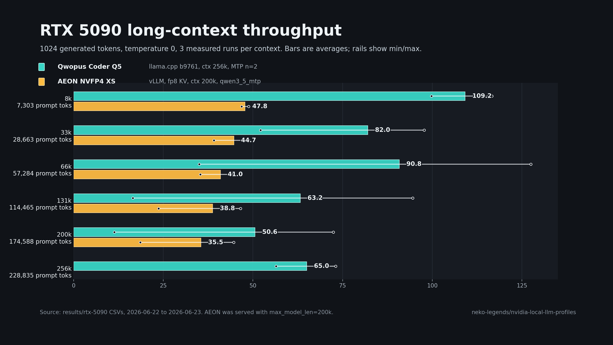
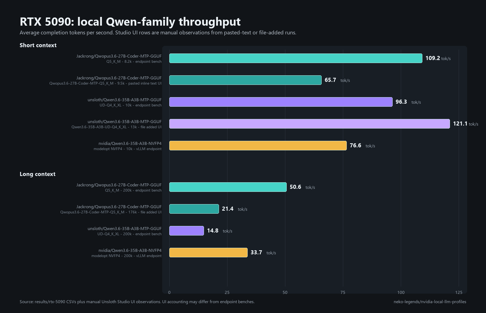

# RTX 5090 Benchmark Results

- **GPU:** NVIDIA GeForce RTX 5090 32GB
- **Driver:** 610.62
- **Dates:** 2026-06-22 to 2026-06-24
- **Prompt style:** BookContext (synthetic long-document with continuity sections)
- **Generation:** 1024 tokens, temperature=0, seed=1234, 3 measured runs per context
- **Token accounting:** prompts are inline chat messages; tok/s is completion
  tokens divided by full request wall time, including prompt ingestion and
  prefill. UI file attachments may use RAG/retrieval and are not equivalent to
  pasting the whole prompt into context.

---

## Results

### Qwopus3.6-27B-Coder-MTP-Q5_K_M — llama.cpp b9761 — ctx=256k — MTP n=2

| Context | Prompt tokens | avg tok/s | min | max | Power | Temp |
| ---: | ---: | ---: | ---: | ---: | ---: | ---: |
| 8k | 7,303 | 109.2 | 99.8 | 116.6 | 355W | 54C |
| 33k | 28,663 | 82.0 | 52.1 | 97.7 | 351W | 58C |
| 66k | 57,284 | 90.8 | 35.1 | 127.5 | 354W | 63C |
| 131k | 114,465 | 63.2 | 16.5 | 94.6 | 341W | 65C |
| 200k | 174,588 | 50.6 | 11.4 | 72.4 | 340W | 67C |
| 256k | 228,835 | 65.0 | 56.5 | 73.0 | 340W | 64C |

**Stack:** LocalAI launcher → llama.cpp server → OpenAI-compatible endpoint at 127.0.0.1:39182  
**Model:** `Qwopus3.6-27B-Coder-MTP-Q5_K_M.gguf`  
**Flags:** `-ngl 999 -fa on -c 262144 -np 1 --spec-type draft-mtp --spec-draft-n-max 2 --spec-draft-ngl 999`

Notes on variance: the wide min/max at 33k–131k is MTP draft hit/miss variance
on cold KV cache. Run 1 includes prefill overhead; runs 2–3 are decode-only and
are tighter. The 256k run was benched separately with a warmup run which explains
the tighter spread.

### AEON Qwen3.6 27B Multimodal NVFP4 MTP-XS — vLLM — ctx=200k — fp8 KV — qwen3_5_mtp

| Context | Prompt tokens | avg tok/s | min | max | Power | Temp |
| ---: | ---: | ---: | ---: | ---: | ---: | ---: |
| 8k | 7,303 | 47.8 | 46.8 | 48.8 | 162W | 47C |
| 33k | 28,663 | 44.7 | 39.1 | 48.8 | 170W | 50C |
| 66k | 57,284 | 41.0 | 35.3 | 44.0 | 176W | 53C |
| 131k | 114,465 | 38.8 | 23.7 | 46.5 | 187W | 57C |
| 200k | 174,588 | 35.5 | 18.6 | 44.7 | 216W | 59C |

- **Stack:** Docker `vllm/vllm-openai:latest` -> OpenAI-compatible endpoint at 127.0.0.1:39183
- **Model:** `AEON-7/Qwen3.6-27B-AEON-Ultimate-Uncensored-Multimodal-NVFP4-MTP-XS`
- **Flags:** `--quantization modelopt --kv-cache-dtype fp8 --max-model-len 200000 --max-num-seqs 1 --max-num-batched-tokens 8192 --gpu-memory-utilization 0.93 --speculative-config '{"method":"qwen3_5_mtp","num_speculative_tokens":3}'`

Notes on serving: the model loaded reliably from a Docker named volume on this
Windows host. The server reported a 200k max context and about 214k GPU KV-cache
tokens available. Throughput was lower than hoped for NVFP4 on this Windows
setup, so these results should be read as a Windows driver/container/NVFP4
compatibility baseline rather than the model's likely ceiling.

### NVIDIA Qwen3.6 35B A3B NVFP4 MoE — vLLM nightly — ctx=200k — fp8 KV

Two-point smoke benchmark only, one measured run per context.

| Context target | Prompt tokens | tok/s | Power | Temp |
| ---: | ---: | ---: | ---: | ---: |
| 10k | 8,905 | 76.6 | 172W | 47C |
| 200k | 174,588 | 33.7 | 228W | 55C |

- **Stack:** Docker `vllm/vllm-openai:nightly` -> OpenAI-compatible endpoint at 127.0.0.1:39184
- **Model:** `nvidia/Qwen3.6-35B-A3B-NVFP4`
- **Flags:** `--quantization modelopt --kv-cache-dtype fp8 --max-model-len 200000 --max-num-seqs 1 --max-num-batched-tokens 8192 --gpu-memory-utilization 0.93 --attention-backend flashinfer --moe-backend marlin`

### Unsloth Qwen3.6 35B A3B MTP GGUF Q4 — llama.cpp b9267 — ctx=200k — MTP n=2

Two-point smoke benchmark only, one measured run per context.

| Context target | Prompt tokens | tok/s | Power | Temp |
| ---: | ---: | ---: | ---: | ---: |
| 10k | 8,907 | 96.3 | 174W | 46C |
| 200k | 174,590 | 14.8 | 226W | 57C |

- **Stack:** llama.cpp server -> OpenAI-compatible endpoint at 127.0.0.1:39185
- **Model:** `unsloth/Qwen3.6-35B-A3B-MTP-GGUF`
- **File:** `Qwen3.6-35B-A3B-UD-Q4_K_XL.gguf`
- **Flags:** `--gpu-layers all --ctx-size 200000 --cache-type-k q4_0 --cache-type-v q4_0 --flash-attn on --reasoning off --spec-type draft-mtp --spec-draft-n-max 2`
- **200k row:** fresh scripted endpoint run on 2026-06-24, separate from manual
  Unsloth Studio UI observations.

Display-output check: a follow-up run with desktop display duties moved from the
RTX 5090 to the RTX 3090 landed at 95.8 tok/s for 10k and 14.7 tok/s for 200k,
so the chart leaves the headless condition out and keeps focus on model/runtime
differences.

### Manual Unsloth Studio UI observations

These rows come from manual UI runs where the benchmark text file was added in
Unsloth Studio. They are charted separately from the endpoint benchmarks because
the UI may report decode-only speed and may handle added files differently than
an inline chat prompt.

| Model | Reported context | UI speed | Extra UI details |
| --- | ---: | ---: | --- |
| Jackrong/Qwopus3.6-27B-Coder-MTP-GGUF Q5_K_M | 9.5k inferred | 65.7 tok/s | pasted inline text, 1,800 generated tokens, 31.76s total, 3.76s prompt eval, 2,525.5 prompt tok/s; RTX 3090 not used after restarting Studio/command prompt |
| Jackrong/Qwopus3.6-27B-Coder-MTP-GGUF Q5_K_M | 176k | 21.4 tok/s | 1,358 generated tokens, 275.57s total, 210.87s prompt eval, 831.1 prompt tok/s; Studio appeared to keep using the RTX 3090 |
| unsloth/Qwen3.6-35B-A3B-MTP-GGUF UD-Q4_K_XL | 13k | 121.1 tok/s | manual UI screenshot observation |

---

## Key Findings

**Qwopus Q5 GGUF via llama.cpp stays interactive across the full 8k-256k ladder.**

- Short context peaks at **109.2 tok/s** @ 8k.
- Long context remains usable at **50.6 tok/s** @ 200k and **65.0 tok/s** @ 256k.
- The 256k run was benched separately with one warmup run, which explains the
  tighter spread there.

**AEON NVFP4 XS via vLLM loaded and completed the 8k-200k ladder, but did not
show high throughput on this Windows setup.**

- The tested vLLM profile used about 31.8GiB of the card's reported 32.6GiB
  during serving, mostly from model plus reserved KV-cache memory.
- Long-context generation stayed stable through the 200k target at
  **35.5 tok/s** average.
- The low observed throughput may point to modelopt NVFP4 maturity,
  driver/runtime compatibility, or container-stack behavior on Windows.
- Prompt prefill can briefly drive the core clock and power very high, which is
  why the Windows underclock profile matters even when VRAM is the real limiter.

---

## Thermal Note

The RTX 5090 reached 67C under sustained Qwopus load while drawing roughly
340-355W, and the AEON vLLM run briefly hit high prefill power during long
prompts before dropping back during generation. For future sweeps:

- Record ambient temperature and fan profile alongside the CSVs.
- Keep airflow stable before running long-context sessions.
- Re-run the 200k/256k contexts after any driver, llama.cpp, or launch-flag change.
