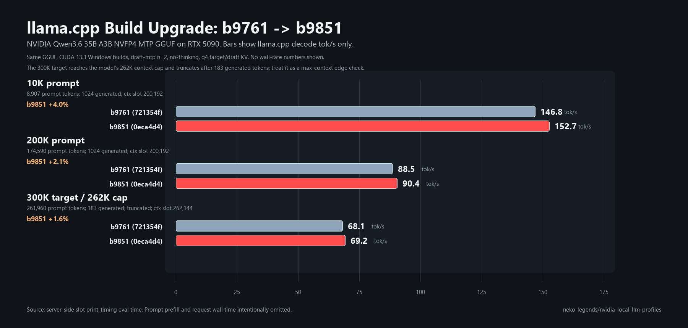
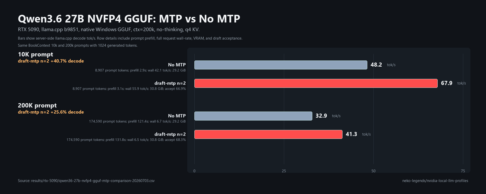
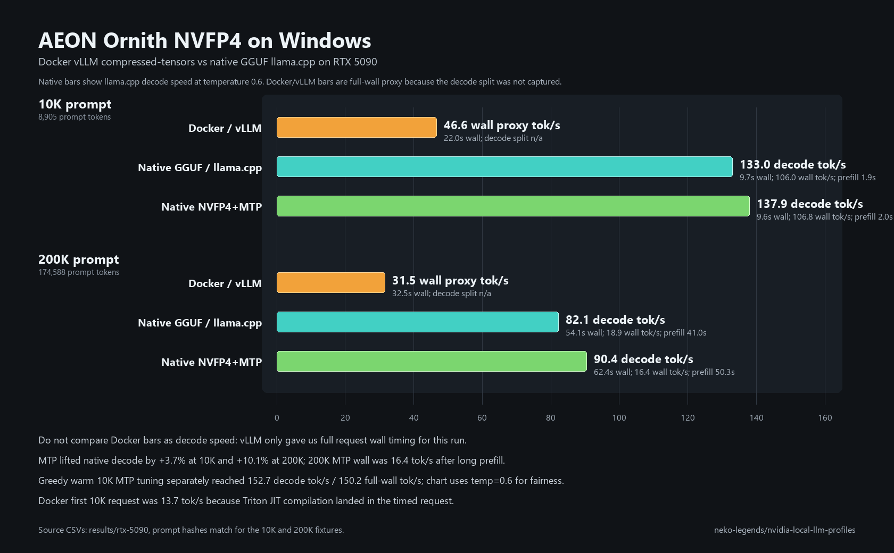
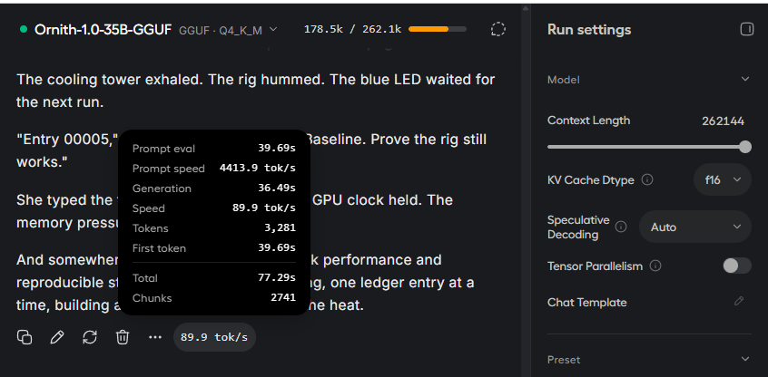

# RTX 5090 Benchmark Results

- **GPU:** NVIDIA GeForce RTX 5090 32GB
- **Driver:** 610.62
- **Dates:** 2026-06-22 to 2026-07-03
- **Prompt style:** BookContext (synthetic long-document with continuity sections)
- **Generation:** 1024 tokens, temperature=0, seed=1234. Full ladders use 3
  measured runs per context; two-point smoke tests may use 1 measured run.
- **Token accounting:** raw ladder CSV `tok/s` is completion tokens divided by
  full request wall time. The native llama.cpp comparison chart uses
  generation-only timing where llama.cpp exposed that split, and lists prompt
  read / prefill seconds separately.

---

## Results

### NVIDIA Qwen3.6 35B A3B NVFP4 MTP GGUF - llama.cpp b9761 vs b9851

Same GGUF, RTX 5090, CUDA 13.3 Windows builds, `draft-mtp` n=2, no-thinking,
q4 target/draft KV. This comparison uses llama.cpp `slot print_timing`
decode/generation speed only; prompt prefill and request wall time are omitted.

| Context target | Prompt tokens | Generated tokens | b9761 decode tok/s | b9851 decode tok/s | Change | Notes |
| ---: | ---: | ---: | ---: | ---: | ---: | --- |
| 10k | 8,907 | 1,024 | 146.8 | 152.7 | +4.0% | normal completion |
| 200k | 174,590 | 1,024 | 88.5 | 90.4 | +2.1% | normal completion |
| 300k target / 262k cap | 261,960 | 183 | 68.1 | 69.2 | +1.6% | `n_ctx_slot=262144`, stopped truncated at 262,143 total tokens |

- **Latest checked build:** llama.cpp b9851 (`0eca4d490`)
- **Old baseline:** llama.cpp b9761 (`721354fbd`)
- **300k prompt SHA256:** `5e3a5f9c15da85d938993ef0c80153d26ba405a13689447fd7082d23355ca4ba`
- **Curated comparison CSV:** `qwen36-35b-a3b-nvfp4-mtp-gguf-llamacpp-build-comparison-20260630.csv`

### NVIDIA Qwen3.6 27B NVFP4 MTP GGUF - llama.cpp b9851 - ctx=200k - MTP vs no-MTP

The source snapshot from `nvidia/Qwen3.6-27B-NVFP4` includes
`mtp_num_hidden_layers=1` and `mtp.layers.0.*` tensors. The native GGUF keeps
that MTP block in `qwen3.6-27b-nvfp4-mtp.gguf`.

| Mode | Context target | Prompt tokens | Full-request tok/s | Generation tok/s | Prompt read | MTP acceptance | VRAM after |
| --- | ---: | ---: | ---: | ---: | ---: | ---: | ---: |
| No MTP | 10k | 8,907 | 42.1 | 48.2 | 2.9s | - | 29.2 GiB |
| draft-mtp n=2 | 10k | 8,907 | 55.9 | 67.9 | 3.1s | 66.9% | 30.8 GiB |
| No MTP | 200k | 174,590 | 6.7 | 32.9 | 121.4s | - | 29.2 GiB |
| draft-mtp n=2 | 200k | 174,590 | 6.5 | 41.3 | 131.8s | 68.3% | 30.8 GiB |

- **Stack:** llama.cpp b9851 (`0eca4d490`) server -> OpenAI-compatible endpoint
  at 127.0.0.1:39195
- **GGUF:** `qwen3.6-27b-nvfp4-mtp.gguf`,
  `28,230,538,624` bytes, SHA256
  `5DECEF7638A9324664010695A49BA1C6EABD18FCFC1616B77C0AFF97B412A233`
- **Flags, MTP:** `--gpu-layers all --gpu-layers-draft all --ctx-size 200000
  --cache-type-k q4_0 --cache-type-v q4_0 --cache-type-k-draft q4_0
  --cache-type-v-draft q4_0 --flash-attn on --reasoning off --spec-type
  draft-mtp --spec-draft-n-max 2`
- **Flags, no MTP:** same target model, but no speculative flags.
- **Prompt SHA256:** 10k `785c5b31d1ce77612431b1289c0a097ed51ab1a6d4a07bccfb7a70f59df55f94`; 200k `a794ca243983eb3387bec6728db4b0c72a99ee2a98cfee7223269708e4ae228c`
- **Curated comparison CSV:** `qwen36-27b-nvfp4-gguf-mtp-comparison-20260703.csv`
- **Headroom note:** `ctx=200000` already reached about 30.8 GiB with MTP on the
  RTX 5090, so this local 5090 profile does not advertise the model card's
  262k maximum context.

### NVIDIA Qwen3.6 35B A3B NVFP4 MTP GGUF - llama.cpp b9761 - ctx=200k - MTP n=2

Two-point native llama.cpp benchmark, one measured run per context. The GGUF was
converted from `nvidia/Qwen3.6-35B-A3B-NVFP4` with the bundled MTP block kept in
the main file.

| Context target | Prompt tokens | Full-request tok/s | Generation tok/s | Prompt read | MTP acceptance | Power | Temp |
| ---: | ---: | ---: | ---: | ---: | ---: | ---: | ---: |
| 10k | 8,907 | 105.0 | 146.8 | 2.6s | 67.6% | 176W | 41C |
| 200k | 174,590 | 16.0 | 88.5 | 51.8s | 60.2% | 224W | 51C |

- **Stack:** llama.cpp b9761 server -> OpenAI-compatible endpoint at 127.0.0.1:39194
- **Model:** `nvidia/Qwen3.6-35B-A3B-NVFP4`
- **File:** `qwen3.6-35b-a3b-nvfp4-mtp.gguf`
- **Saved size:** `23,850,227,712` bytes (`22.21 GiB`)
- **SHA256:** `B7C0806BD45428DA1A980A1A8F68279FD85D7D56292D64AAD97C65CB5FDD8C91`
- **GGUF metadata:** `qwen35moe`, `file_type=39`, `context_length=262144`,
  `nextn_predict_layers=1`
- **Flags:** `--gpu-layers all --gpu-layers-draft all --ctx-size 200000 --cache-type-k q4_0 --cache-type-v q4_0 --cache-type-k-draft q4_0 --cache-type-v-draft q4_0 --flash-attn on --reasoning off --spec-type draft-mtp --spec-draft-n-max 2`
- **No-thinking mode:** server logged `chat template, thinking = 0`, and the
  benchmark request sent `chat_template_kwargs.enable_thinking=false`.
- **Prompt SHA256:** 10k `785c5b31d1ce77612431b1289c0a097ed51ab1a6d4a07bccfb7a70f59df55f94`; 200k `a794ca243983eb3387bec6728db4b0c72a99ee2a98cfee7223269708e4ae228c`
- **CSV:** `qwen36-35b-a3b-nvfp4-mtp-gguf-llamacpp-ctx200k-draft-mtp-mtpn2-request-nothink-prompt10k-gen1024-20260630-104508.csv`
  and `qwen36-35b-a3b-nvfp4-mtp-gguf-llamacpp-ctx200k-draft-mtp-mtpn2-request-nothink-prompt200k-gen1024-20260630-104519.csv`

### Qwopus3.6 35B A3B Coder MTP Q5_K_M - llama.cpp b9267 - ctx=200k - MTP

Two-point native llama.cpp benchmark, one measured run per context. The model
loaded at `n_ctx=200192` from the repo-relative local model cache path.

| Context target | Prompt tokens | Full-request tok/s | Generation tok/s | Prompt read | Power | Temp |
| ---: | ---: | ---: | ---: | ---: | ---: | ---: |
| 10k | 8,907 | 111.8 | 148.6 | 2.1s | 184W | 44C |
| 200k | 174,590 | 15.5 | 102.5 | 55.5s | 232W | 54C |

- **Stack:** llama.cpp server -> OpenAI-compatible endpoint at 127.0.0.1:39191
- **Model:** `Jackrong/Qwopus3.6-35B-A3B-Coder-MTP-GGUF`
- **File:** `Qwopus3.6-35B-A3B-Coder-MTP-Q5_K_M.gguf`
- **Downloaded size:** `25,347,531,936` bytes
- **No-thinking mode:** send `chat_template_kwargs.enable_thinking=false` in the
  OpenAI-compatible request body. On the same server, an auto request produced
  `reasoning_content`, while the request-level no-thinking probe produced normal
  content without a reasoning block. Passing the same value through global
  `--chat-template-kwargs` is deprecated in this llama.cpp build.
- **Flags:** `--gpu-layers all --gpu-layers-draft all --ctx-size 200000
  --cache-type-k q4_0 --cache-type-v q4_0 --cache-type-k-draft q4_0
  --cache-type-v-draft q4_0 --flash-attn on --spec-type draft-mtp
  --spec-draft-n-max 2`
- **Spec-type check:** pure `draft-mtp` n=2 beat the previous
  `ngram-mod,draft-mtp` n=2 profile at 200k (**102.5** vs **100.0 tok/s**),
  while landing essentially tied at 10k (**148.6** vs **149.0 tok/s**).
- **MTP depth check:** `--spec-draft-n-max 3` improved the 10k check to
  **153.8 tok/s**, but lowered the 200k check to **94.6 tok/s**. A pure
  `draft-mtp` n=3 10k check was effectively tied at **153.3 tok/s**. The chart
  keeps Q5 on pure `draft-mtp` n=2 because n=2 is the stronger 200k profile.
- **MTP acceptance:** 10k `572/900 = 63.6%`; 200k `626/792 = 79.0%`
- **Prompt prefill note:** no-thinking prevents generated reasoning blocks, but
  it does not skip prompt ingestion. The 200k run followed the 10k run in the
  same server, so llama.cpp reused the shared prefix and still prefilled 166,199
  new prompt tokens.
- **Prompt SHA256:** 10k `785c5b31d1ce77612431b1289c0a097ed51ab1a6d4a07bccfb7a70f59df55f94`; 200k `a794ca243983eb3387bec6728db4b0c72a99ee2a98cfee7223269708e4ae228c`
- **CSV:** `qwopus3.6-35b-a3b-coder-mtp-q5-k-m-llamacpp-ctx200k-draft-mtp-mtpn2-request-nothink-prompt10k-gen1024-20260630-013212.csv`
  and `qwopus3.6-35b-a3b-coder-mtp-q5-k-m-llamacpp-ctx200k-draft-mtp-mtpn2-request-nothink-prompt200k-gen1024-20260630-013223.csv`
- **Probe CSV:** `qwopus3.6-35b-a3b-coder-mtp-q5-k-m-llamacpp-ctx200k-ngram-mod-draft-mtp-mtpn3-request-nothink-prompt10k-gen1024-20260630-012703.csv`
  and `qwopus3.6-35b-a3b-coder-mtp-q5-k-m-llamacpp-ctx200k-ngram-mod-draft-mtp-mtpn3-request-nothink-prompt200k-gen1024-20260630-012714.csv`
- **Timing log:** `logs/qwopus35-q5-bench-server-20260630-013150.err.log`

### Qwopus3.6 35B A3B Coder MTP Q4_K_M - llama.cpp b9267 - ctx=200k - MTP + ngram

Two-point native llama.cpp benchmark, one measured run per context. This uses
the same request-level no-thinking mode and the same saved prompt fixtures as
the Q5_K_M run.

| Context target | Prompt tokens | Full-request tok/s | Generation tok/s | Prompt read | Power | Temp |
| ---: | ---: | ---: | ---: | ---: | ---: | ---: |
| 10k | 8,907 | 128.2 | 181.0 | 2.2s | 175W | 44C |
| 200k | 174,590 | 15.3 | 91.2 | 55.1s | 226W | 52C |

- **Stack:** llama.cpp server -> OpenAI-compatible endpoint at 127.0.0.1:39193
- **Model:** `Jackrong/Qwopus3.6-35B-A3B-Coder-MTP-GGUF`
- **File:** `Qwopus3.6-35B-A3B-Coder-MTP-Q4_K_M.gguf`
- **Downloaded size:** `21,713,462,432` bytes
- **SHA256:** `c283cd2321a3cb4c6e7faf9481ac7d946913e4f02e20172eb2872112f567d8d4`
- **Flags:** `--gpu-layers all --gpu-layers-draft all --ctx-size 200000
  --cache-type-k q4_0 --cache-type-v q4_0 --cache-type-k-draft q4_0
  --cache-type-v-draft q4_0 --flash-attn on --spec-type ngram-mod,draft-mtp
  --spec-draft-n-max 2 --spec-ngram-mod-n-match 24
  --spec-ngram-mod-n-min 48 --spec-ngram-mod-n-max 64`
- **MTP depth check:** a 10k `--spec-draft-n-max 3` trial was slower
  (**163.6 tok/s**) than n=2 (**181.6 tok/s**), so the chart uses n=2.
- **MTP acceptance:** 10k `688/957 = 71.9%`; 200k `598/1159 = 51.6%`
- **CSV:** `qwopus3.6-35b-a3b-coder-mtp-q4-k-m-llamacpp-ctx200k-mtpn2-request-nothink-prompt10k-gen1024-20260630-011615.csv`
  and `qwopus3.6-35b-a3b-coder-mtp-q4-k-m-llamacpp-ctx200k-mtpn2-request-nothink-prompt200k-gen1024-20260630-011625.csv`
- **Timing log:** `logs/qwopus35-q4-bench-server-20260630-011553.err.log`

### Qwopus3.6-27B-Coder-MTP-Q5_K_M — llama.cpp b9761 — ctx=256k — MTP n=2

| Context | Prompt tokens | avg tok/s | min | max | Power | Temp |
| ---: | ---: | ---: | ---: | ---: | ---: | ---: |
| 8k | 7,303 | 109.2 | 99.8 | 116.6 | 355W | 54C |
| 33k | 28,663 | 82.0 | 52.1 | 97.7 | 351W | 58C |
| 66k | 57,284 | 90.8 | 35.1 | 127.5 | 354W | 63C |
| 131k | 114,465 | 63.2 | 16.5 | 94.6 | 341W | 65C |
| 200k | 174,588 | 50.6 | 11.4 | 72.4 | 340W | 67C |
| 256k | 228,835 | 65.0 | 56.5 | 73.0 | 340W | 64C |

**Stack:** LocalAI launcher → llama.cpp server → OpenAI-compatible endpoint at 127.0.0.1:39182  
**Model:** `Qwopus3.6-27B-Coder-MTP-Q5_K_M.gguf`  
**Flags:** `-ngl 999 -fa on -c 262144 -np 1 --spec-type draft-mtp --spec-draft-n-max 2 --spec-draft-ngl 999`

Notes on variance: the wide min/max at 33k–131k is MTP draft hit/miss variance
on a fresh KV cache. The original Q5 ladder's llama.cpp timing log was not
captured, so the comparison chart estimates 200k generation speed from repeat
requests and estimates prompt read time as first-request wall time minus
repeat-request wall time: **70.2 tok/s generation** with **~75.6s prompt read**
at 200k. The table above remains the raw full-request ladder summary. The 256k
run was benched separately with a warmup run which explains the tighter spread.

### Qwopus3.6-27B-Coder-MTP-Q5_K_M — 10k reference prompt rerun — llama.cpp b9267

This one-pass rerun uses the checked-in prompt file
`benchmarks/prompts/book-context-10k.txt`, the same prompt text used by the Q4
10k check.

| Context target | Prompt tokens | Full-request tok/s | Generation tok/s | Prompt read | Power | Temp |
| ---: | ---: | ---: | ---: | ---: | ---: | ---: |
| 10k | 8,907 | 60.5 | 79.5 | 3.9s | 349W | 55C |

- **Prompt SHA256:** `785c5b31d1ce77612431b1289c0a097ed51ab1a6d4a07bccfb7a70f59df55f94`
- **CSV:** `qwopus-coder-mtp-q5-ctx256k-mtp-ref10k-gen1024-20260624-194440.csv`
- **Timing log:** `logs/qwopus-q5-ref10k-server-20260624-194440.err.log`
- **Timing note:** exact llama.cpp `print_timing` values: prompt eval
  3932.42 ms, generation eval 1024 tokens at 79.52 tok/s.

### Qwopus3.6-27B-Coder-MTP-Q4_K_M — llama.cpp b9267 — ctx=256k — MTP + ngram

Two-point fallback check only, one measured run per context. llama.cpp
`print_timing` gives the generation and prompt-eval split.

| Context target | Prompt tokens | Full-request tok/s | Generation tok/s | Prompt read | Power | Temp |
| ---: | ---: | ---: | ---: | ---: | ---: | ---: |
| 10k | 8,908 | 66.4 | 89.2 | 3.8s | 345W | 54C |
| 200k | 174,591 | 6.3 | 46.4 | 141.1s | 351W | 68C |

- **Stack:** llama.cpp server -> OpenAI-compatible endpoint at 127.0.0.1:39186
- **Model:** `Jackrong/Qwopus3.6-27B-Coder-MTP-GGUF`
- **File:** `Qwopus3.6-27B-Coder-MTP-Q4_K_M.gguf`
- **Flags:** `--gpu-layers all --ctx-size 262144 --cache-type-k q4_0 --cache-type-v q4_0 --flash-attn on --reasoning off --spec-type ngram-mod,draft-mtp --spec-draft-n-max 2`
- **Timing note:** the 200k prompt read value is exact llama.cpp prompt-eval
  time for 166,199 newly processed prompt tokens after prompt-cache reuse.

### AEON Qwen3.6 27B Multimodal NVFP4 MTP-XS — vLLM — ctx=200k — fp8 KV — qwen3_5_mtp

| Context | Prompt tokens | avg tok/s | min | max | Power | Temp |
| ---: | ---: | ---: | ---: | ---: | ---: | ---: |
| 8k | 7,303 | 47.8 | 46.8 | 48.8 | 162W | 47C |
| 33k | 28,663 | 44.7 | 39.1 | 48.8 | 170W | 50C |
| 66k | 57,284 | 41.0 | 35.3 | 44.0 | 176W | 53C |
| 131k | 114,465 | 38.8 | 23.7 | 46.5 | 187W | 57C |
| 200k | 174,588 | 35.5 | 18.6 | 44.7 | 216W | 59C |

- **Stack:** Docker `vllm/vllm-openai:latest` -> OpenAI-compatible endpoint at 127.0.0.1:39183
- **Model:** `AEON-7/Qwen3.6-27B-AEON-Ultimate-Uncensored-Multimodal-NVFP4-MTP-XS`
- **Flags:** `--quantization modelopt --kv-cache-dtype fp8 --max-model-len 200000 --max-num-seqs 1 --max-num-batched-tokens 8192 --gpu-memory-utilization 0.93 --speculative-config '{"method":"qwen3_5_mtp","num_speculative_tokens":3}'`

Notes on serving: the model loaded reliably from a Docker named volume on this
Windows host. The server reported a 200k max context and about 214k GPU KV-cache
tokens available. Throughput was lower than hoped for NVFP4 on this Windows
setup, so these results should be read as a Windows driver/container/NVFP4
compatibility baseline rather than the model's likely ceiling.

### AEON Ornith 1.0 35B Ultimate Uncensored NVFP4 - Windows Docker vs native GGUF

Two-point comparison only, one measured run per context. The Docker rows use
vLLM with the original compressed-tensors NVFP4 model. The base native rows use
a local base-only GGUF conversion for comparison. The MTP rows use
`neko-legends/Ornith-1.0-35B-AEON-Ultimate-Uncensored-NVFP4-GGUF-MTP/ornith-1.0-35b-aeon-ultimate-uncensored-nvfp4-gguf-mtp.gguf`,
which keeps the AEON Ultimate Uncensored NVFP4 trunk/body and grafts a compatible
MTP block because the AEON safetensors release did not include `blk.40.*` MTP
tensors.
Official GGUF mirror and model card:
[neko-legends/Ornith-1.0-35B-AEON-Ultimate-Uncensored-NVFP4-GGUF-MTP](https://huggingface.co/neko-legends/Ornith-1.0-35B-AEON-Ultimate-Uncensored-NVFP4-GGUF-MTP).

| Runtime | Context target | Prompt tokens | Full-request tok/s | Generation tok/s | Prompt prefill | Wall time | Power | Temp |
| --- | ---: | ---: | ---: | ---: | ---: | ---: | ---: | ---: |
| Docker vLLM, first 10k request | 10k | 8,905 | 13.7 | n/a | n/a | 75.0s | 244W | 44C |
| Docker vLLM, warm 10k rerun | 10k | 8,905 | 46.6 | n/a | n/a | 22.0s | 147W | 42C |
| Native GGUF llama.cpp | 10k | 8,905 | 106.0 | 133.0 | 1.9s | 9.7s | 224W | 44C |
| Native Ultimate Uncensored MTP llama.cpp, temp=0.6 | 10k | 8,905 | 101.5 | 131.5 | 2.2s | 10.1s | 209W | 41C |
| Docker vLLM | 200k | 174,588 | 31.5 | n/a | n/a | 32.5s | 270W | 50C |
| Native GGUF llama.cpp | 200k | 174,588 | 18.9 | 82.1 | 41.0s | 54.1s | 321W | 56C |
| Native Ultimate Uncensored MTP llama.cpp, temp=0.6 | 200k | 174,588 | 15.9 | 86.0 | 52.1s | 64.5s | 231W | 50C |

- **Docker stack:** Docker `vllm/vllm-openai:nightly` -> OpenAI-compatible endpoint at 127.0.0.1:39187
- **Native stack:** Windows `llama.cpp-b9267-cuda13.1`
- **Base native flags:** `--gpu-layers all --ctx-size 262144 --cache-type-k q4_0 --cache-type-v q4_0 --flash-attn on`
- **MTP native flags:** base flags plus `--gpu-layers-draft all
  --cache-type-k-draft q4_0 --cache-type-v-draft q4_0 --spec-type
  draft-mtp,ngram-mod --spec-draft-n-max 3 --spec-ngram-mod-n-match 24
  --spec-ngram-mod-n-min 48 --spec-ngram-mod-n-max 64`
- **Conversion note:** the successful GGUF conversion used upstream
  `convert_hf_to_gguf.py --no-mtp`; without `--no-mtp`, llama.cpp expected a
  missing `blk.40.*` tensor group from the MTP metadata.
- **MTP note:** AEON's compressed-tensors safetensors release advertises
  `mtp_num_hidden_layers=1`, but the downloaded `model.safetensors` contained
  no `mtp`, `nextn`, or `model.layers.40` tensors. The measured MTP file keeps
  the AEON trunk/body and grafts the required compatible `blk.40.*` MTP tensors.
- **Native load note:** llama.cpp reported `BLACKWELL_NATIVE_FP4 = 1`, so the
  GGUF path is native Windows FP4 rather than Docker-mediated vLLM.
- **Timing note:** the native GGUF `18.9 tok/s` 200k row is full-request wall
  throughput, not decode speed and not model warmup. llama.cpp reported
  **82.1 tok/s generation** after **41.0s prompt prefill** for that same run.
- **Tuning note:** with `draft-mtp`, `--spec-draft-n-max 2`, and temp=0.6, the
  10k pass reached **133.7 decode tok/s** and **104.0 full-wall tok/s**.
- **Censorship smoke:** the Ultimate Uncensored MTP GGUF answered a small set of
  politically sensitive history/current-affairs prompts without refusal/evasion
  markers.
- **Prompt SHA256:** 10k `785c5b31d1ce77612431b1289c0a097ed51ab1a6d4a07bccfb7a70f59df55f94`; 200k `a794ca243983eb3387bec6728db4b0c72a99ee2a98cfee7223269708e4ae228c`
- **Chart:** `assets/images/aeon-ornith-windows-docker-vs-gguf.png`; native
  GGUF bars show llama.cpp decode speed, while Docker/vLLM bars are labeled as
  full-request wall proxies because the vLLM decode split was not captured.

### NVIDIA Qwen3.6 35B A3B NVFP4 MoE — vLLM nightly — ctx=200k — fp8 KV

Two-point smoke benchmark only, one measured run per context. The current CSV
rows match the saved prompt fixtures:
`benchmarks/prompts/book-context-10k.txt` and
`benchmarks/prompts/book-context-200k.txt`.

| Context target | Prompt tokens | tok/s | Power | Temp |
| ---: | ---: | ---: | ---: | ---: |
| 10k reference | 8,905 | 92.0 | 172W | 48C |
| 200k reference | 174,588 | 30.5 | 231W | 56C |

- **Stack:** Docker `vllm/vllm-openai:nightly` -> OpenAI-compatible endpoint at 127.0.0.1:39184
- **Model:** `nvidia/Qwen3.6-35B-A3B-NVFP4`
- **Flags:** `--quantization modelopt --kv-cache-dtype fp8 --max-model-len 200000 --max-num-seqs 1 --max-num-batched-tokens 8192 --gpu-memory-utilization 0.93 --attention-backend flashinfer --moe-backend marlin`
- **Prompt SHA256:** 10k `785c5b31d1ce77612431b1289c0a097ed51ab1a6d4a07bccfb7a70f59df55f94`; 200k `a794ca243983eb3387bec6728db4b0c72a99ee2a98cfee7223269708e4ae228c`
- **CSV:** `qwen36-35b-a3b-nvfp4-vllm-fp8kv-ctx200k-prompt10k-gen1024-20260624-201006.csv`
  and `qwen36-35b-a3b-nvfp4-vllm-fp8kv-ctx200k-prompt200k-gen1024-20260624-201026.csv`

### Unsloth Qwen3.6 35B A3B MTP GGUF Q4 — llama.cpp b9267 — ctx=200k — MTP n=2

Two-point smoke benchmark only, one measured run per context.

| Context target | Prompt tokens | tok/s | Power | Temp |
| ---: | ---: | ---: | ---: | ---: |
| 10k | 8,907 | 96.3 | 174W | 46C |
| 200k | 174,590 | 14.8 | 226W | 57C |

- **Stack:** llama.cpp server -> OpenAI-compatible endpoint at 127.0.0.1:39185
- **Model:** `unsloth/Qwen3.6-35B-A3B-MTP-GGUF`
- **File:** `Qwen3.6-35B-A3B-UD-Q4_K_XL.gguf`
- **Flags:** `--gpu-layers all --ctx-size 200000 --cache-type-k q4_0 --cache-type-v q4_0 --flash-attn on --reasoning off --spec-type draft-mtp --spec-draft-n-max 2`
- **200k row:** fresh scripted endpoint run on 2026-06-24, separate from manual
  `(Unsloth Studio)` observations.

Display-output check: a follow-up run with desktop display duties moved from the
RTX 5090 to the RTX 3090 landed at 95.8 tok/s for 10k and 14.7 tok/s for 200k,
so the chart leaves the headless condition out and keeps focus on model/runtime
differences.

### DeepReinforce Ornith 1.0 35B GGUF Q4_K_M — llama.cpp b9267 — ctx=256k

Two-point smoke benchmark only, one measured run per context. The server ran
with reasoning mode enabled because Ornith is a reasoning model.

| Context target | Prompt tokens | Full-request tok/s | Generation tok/s | Prompt read | Power | Temp |
| ---: | ---: | ---: | ---: | ---: | ---: | ---: |
| 10k reference | 8,905 | 181.0 warm wall | 184.5 warm avg | 1.7s cold | 208W | 45C |
| 200k reference | 174,588 | 20.3 | 106.7 | 40.3s | 478W | 66C |

- **Stack:** llama.cpp server -> OpenAI-compatible endpoint at 127.0.0.1:39188
- **Model:** `deepreinforce-ai/Ornith-1.0-35B-GGUF`
- **File:** `ornith-1.0-35b-Q4_K_M.gguf`
- **Flags:** `--gpu-layers all --ctx-size 262144 --cache-type-k q4_0 --cache-type-v q4_0 --flash-attn on --reasoning on`
- **10k rerun note:** the chart uses the 2026-06-30 rerun for the 10k bar:
  warm repeat generation averaged **184.5 tok/s** from runs 2-3
  (`184.14`, `184.76`). The older 2026-06-25 single 10k run measured
  **201.5 tok/s**, but the repeat check landed in the 180s.
- **Prompt SHA256:** 10k `785c5b31d1ce77612431b1289c0a097ed51ab1a6d4a07bccfb7a70f59df55f94`; 200k `a794ca243983eb3387bec6728db4b0c72a99ee2a98cfee7223269708e4ae228c`
- **CSV:** `ornith-1.0-35b-q4-k-m-llamacpp-ctx256k-prompt10k-gen1024-20260625-114352.csv`
  plus rerun `ornith-1.0-35b-q4-k-m-llamacpp-ctx256k-rerun10k-gen1024-20260630-004126.csv`;
  200k remains `ornith-1.0-35b-q4-k-m-llamacpp-ctx256k-prompt200k-gen1024-20260625-114359.csv`
- **Timing note:** the 200k prompt read value is exact llama.cpp prompt-eval
  time for 166,199 newly processed prompt tokens after prompt-cache reuse from
  the preceding 10k run.

### Manual (Unsloth Studio) Observations

These rows come from manual runs in Unsloth Studio where the benchmark text was
pasted or added as a file. They are kept out of the native headline chart
because the UI may report decode-only speed and may handle added files
differently than an inline chat prompt.

| Model | Reported context | UI speed | Extra UI details |
| --- | ---: | ---: | --- |
| Jackrong/Qwopus3.6-27B-Coder-MTP-GGUF Q5_K_M | 9.5k inferred | 65.7 tok/s | pasted inline text, 1,800 generated tokens, 31.76s total, 3.76s prompt eval, 2,525.5 prompt tok/s; RTX 3090 not used after restarting Studio/command prompt |
| Jackrong/Qwopus3.6-27B-Coder-MTP-GGUF Q5_K_M | 176k | 21.4 tok/s | 1,358 generated tokens, 275.57s total, 210.87s prompt eval, 831.1 prompt tok/s; Studio appeared to keep using the RTX 3090 |
| unsloth/Qwen3.6-35B-A3B-MTP-GGUF UD-Q4_K_XL | 13k | 121.1 tok/s | manual UI screenshot observation |
| unsloth/Qwen3.6-35B-A3B-MTP-GGUF UD-Q4_K_XL | 179.5k | 95.7 tok/s | 4,325 generated tokens, 96.20s total, 49.42s prompt eval, 3,544.2 prompt tok/s; Studio launched with only RTX 5090 visible |
| deepreinforce-ai/Ornith-1.0-35B-GGUF Q4_K_M | 9.5k inferred | 127.2 tok/s | 2,523 generated tokens, 22.65s total, 1.75s prompt eval, 5,427.6 prompt tok/s; context inferred from prompt eval × prompt speed |
| deepreinforce-ai/Ornith-1.0-35B-GGUF Q4_K_M | 175.2k inferred | 89.9 tok/s | 3,281 generated tokens, 77.29s total, 39.69s prompt eval, 4,413.9 prompt tok/s; context inferred from prompt eval × prompt speed |

Ornith Unsloth Studio long-context proof:

---

## Key Findings

**Qwopus3.6 35B A3B Coder Q5_K_M is a strong native no-thinking 35B coding-model result on the RTX 5090.**

- The 10k checked-in prompt reached **149.0 tok/s generation** after **2.1s**
  prompt prefill.
- The 200k checked-in prompt reached **100.0 tok/s generation** after **55.8s**
  prompt prefill.
- Qwopus35 Q4_K_M reached **181.0 tok/s generation** at the 10k prompt, but
  **91.2 tok/s** at the 200k prompt; on this setup Q4 wins short-context
  latency while Q5 remains better at 200k decode speed.
- The 200k run stayed under the card's VRAM budget with 28,358 MiB reported
  after the request.

**Qwopus Q5 GGUF via llama.cpp stays interactive across the full 8k-256k ladder.**

- Raw full-request ladder average remains **50.6 tok/s** @ 200k and
  **65.0 tok/s** @ 256k.
- On the checked-in 10k reference prompt, Q5 measured **79.5 tok/s generation**
  after **3.9s prompt read**.
- For the comparison chart, Q5 generation is estimated from repeat runs:
  **70.2 tok/s generation** @ 200k with **~75.6s prompt read**.
- Q4's exact llama.cpp split at 200k was **46.4 tok/s generation** after
  **141.1s prompt read**, so Q4 is slower than Q5 but not as absurd as the old
  full-request bar implied.
- The 256k run was benched separately with one warmup run, which explains the
  tighter spread there.

**AEON NVFP4 XS via vLLM loaded and completed the 8k-200k ladder, but did not
show high throughput on this Windows setup.**

- The tested vLLM profile used about 31.8GiB of the card's reported 32.6GiB
  during serving, mostly from model plus reserved KV-cache memory.
- Long-context generation stayed stable through the 200k target at
  **35.5 tok/s** average.
- The low observed throughput may point to modelopt NVFP4 maturity,
  driver/runtime compatibility, or container-stack behavior on Windows.
- Prompt prefill can briefly drive the core clock and power very high, which is
  why the Windows underclock profile matters even when VRAM is the real limiter.

---

## Thermal Note

The RTX 5090 reached 67C under sustained Qwopus load while drawing roughly
340-355W, and the AEON vLLM run briefly hit high prefill power during long
prompts before dropping back during generation. For future sweeps:

- Record ambient temperature and fan profile alongside the CSVs.
- Keep airflow stable before running long-context sessions.
- Re-run the 200k/256k contexts after any driver, llama.cpp, or launch-flag change.
