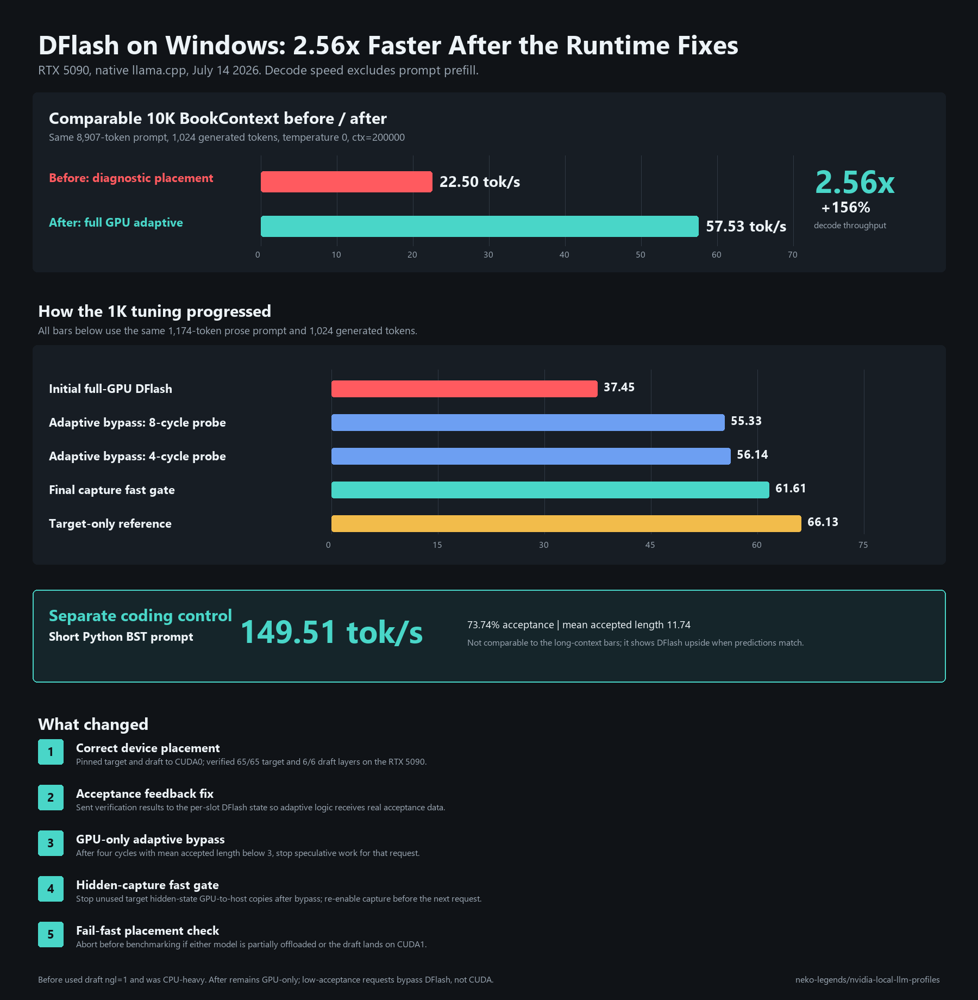

# Qwen3.6 27B Q4_K_M + DFlash Q8_0

Native Windows CUDA profile pairing the base Qwen3.6 27B Q4_K_M target with
spiritbuun's recommended Q8_0 DFlash drafter.

## Credits and provenance

- Target GGUF: [unsloth/Qwen3.6-27B-GGUF](https://huggingface.co/unsloth/Qwen3.6-27B-GGUF), file `Qwen3.6-27B-Q4_K_M.gguf`.
- DFlash drafter: [spiritbuun/Qwen3.6-27B-DFlash-GGUF](https://huggingface.co/spiritbuun/Qwen3.6-27B-DFlash-GGUF), file `dflash-draft-3.6-q8_0.gguf`.
- Runtime fork: [spiritbuun/buun-llama-cpp](https://github.com/spiritbuun/buun-llama-cpp), pinned to commit `34501c5`.

Both GGUFs are downloaded unchanged. This profile modifies the serving
runtime and launch configuration, not the model weights.

1. Run `download-qwen36-27b-q4-k-m-target.bat`.
2. Run `download-qwen36-27b-dflash-q8-0.bat`.
3. Run `bootstrap-cuda-13.3-portable.bat` when CUDA 13.3 is not installed.
4. Run `build-buun-dflash-sm120-runtime.bat` once.
5. Run `install-hermes-qwen36-27b-q4-k-m-dflash-q8-0.bat`.
6. Run `start-qwen36-27b-q4-k-m-dflash-q8-0-server.bat`.
7. Select `qwen36-27b-q4-k-m-dflash-q8-0` in Hermes.

The endpoint is `http://127.0.0.1:39201/v1`. The launcher disables thinking,
uses a 200,000-token target context and a 256-token draft context, explicitly
pins both contexts to the RTX 5090 with `--device CUDA0 --device-draft CUDA0`,
and offloads every target and drafter layer. The tuned DFlash preset uses the
drafter's full 15-token horizon. DFlash is an alternative speculative decoder
to the target GGUF's built-in MTP head; this profile does not run both.

The runtime is pinned to `spiritbuun/buun-llama-cpp` commit `34501c5`, which
includes the long-prefill GPU ring fix, and is compiled with CUDA 13.3 for
Blackwell architecture `120a`. Run `bootstrap-cuda-13.3-portable.ps1` first
when CUDA 13.3 is not installed system-wide.

## Full-GPU adaptive result

The corrected runtime keeps both models on CUDA0 and probes DFlash for four
draft cycles. If mean accepted length is below 3 tokens, it disables the whole
speculative chain and its hidden-state capture for the rest of that request.
Generation continues target-only on the RTX 5090; this is not CPU fallback.

- 1,174-token BookContext gate: 61.61 decode tok/s overall, settling near
  62.9 tok/s after bypass. Pure target-only measured 66.13 tok/s.
- 8,907-token BookContext fixture at `ctx=200000`: 57.53 decode tok/s, 5.39s
  prefill, and 43.87 full-request tok/s. DFlash bypassed after four cycles.
- 37-token Python BST coding probe: 149.51 decode tok/s, 73.74% acceptance,
  mean accepted length 11.74, and no bypass.

This is workload-dependent speculative decoding: low-acceptance prose stays
close to target-only CUDA speed, while predictable code can receive a large
DFlash gain. The benchmark launcher verifies `65/65` target layers and `6/6`
draft layers are offloaded to CUDA0 before it sends a prompt. llama.cpp still
reports small `CPU_Mapped` model buffers in a fully offloaded run; those file
mappings are not CPU model-layer execution.

## What changed

The same 8,907-token BookContext test improved from **22.50 tok/s** in the
CPU-heavy placement diagnostic to **57.53 tok/s** with the corrected runtime,
or **2.56x (+156%)**. The changes were:

1. Explicitly pin both the target and draft models to CUDA0.
2. Require complete `65/65` target and `6/6` draft layer offload.
3. Send verification results to each slot's own DFlash acceptance state and ignore unrelated speculative callbacks.
4. After four DFlash cycles with mean accepted length below 3, bypass the speculative chain for that request without leaving the GPU.
5. Stop hidden-state GPU-to-host capture after bypass and re-enable it at the next request.
6. Fail before sending a benchmark prompt if the logs show partial offload or CUDA1 placement.

The 1K tuning fixture moved from **37.45** tok/s for the initial full-GPU
implementation to **55.33**, **56.14**, and finally **61.61** tok/s as the
adaptive bypass and hidden-capture gate were tightened. Target-only measured
**66.13 tok/s**. The separate short coding control reached **149.51 tok/s**
because DFlash predictions matched well; it is not a like-for-like comparison
with the long-context fixtures.

Source data is in
`results/rtx-5090/qwen36-27b-dflash-tuning-20260714.csv`. Regenerate the chart
with `scripts/benchmarks/render-qwen36-27b-dflash-before-after-chart.py`.

## Historical diagnostic baseline

Before the drafter device was pinned explicitly, the fork selected CUDA1 (an
RTX 3090) for drafter warmup. The runtime contains `sm_120a` kernels for the
RTX 5090, so that cross-device mistake surfaced as CUDA `no kernel image`.
An interim CPU-heavy diagnostic run used `--gpu-layers-draft 1` and measured:

- 8,907-token prompt: 22.50 decode tok/s, 12.34% draft acceptance.
- 174,590-token prompt: 14.05 decode tok/s, 10.31% draft acceptance.
- Four of the five drafter transformer blocks ran on CPU in that diagnostic.

These numbers are retained only as a failed-placement baseline and are not
representative full-GPU DFlash performance. The launcher requests
`--gpu-layers-draft all` on CUDA0; the benchmark additionally aborts unless
both target and draft report complete CUDA0 layer offload.

## Performance promotion gate

Runtime changes are tested first with the 1K BookContext fixture. Do not run a
200K benchmark while diagnosing startup or low throughput. Promote a candidate
to 10K only after it completes with full drafter GPU offload, no CUDA errors,
and materially better acceptance and decode speed than the compatibility mode.
The 10K gate is now stable. The 200K prompt has not been rerun with this
adaptive build, so its old `ngld=1` result remains historical only.
